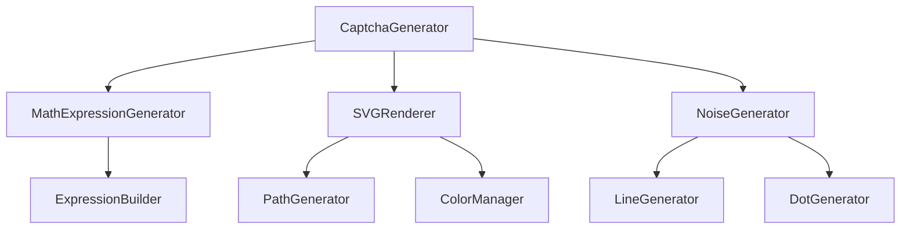
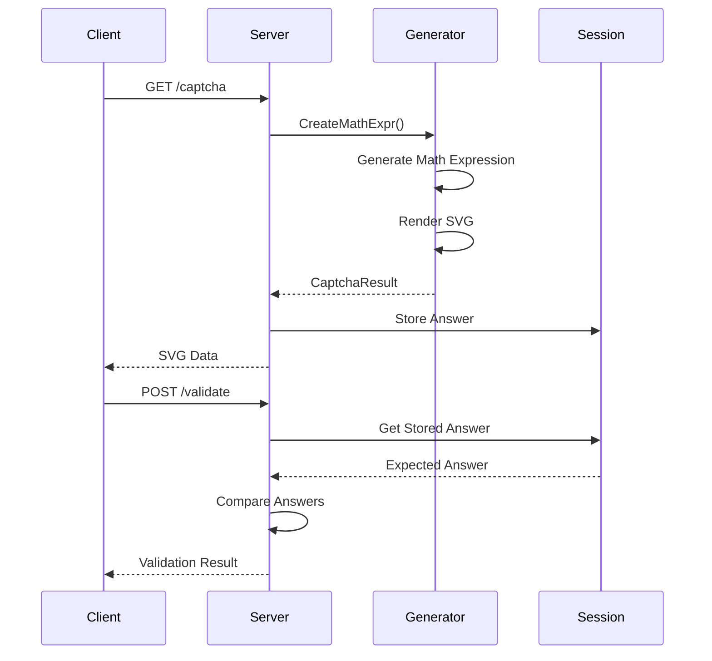

# SVG Math Captcha - Go Implementation Design

## Overview

This document outlines the design for implementing an SVG-based math captcha system in Go, inspired by the node svg-captcha library. The system will generate dynamic SVG images containing mathematical expressions that users must solve to verify they are human.

### Key Features
- Generate SVG-based math captcha images
- Configurable math expression complexity
- Customizable visual styling (colors, fonts, noise)
- Lightweight implementation with no external image processing dependencies
- Thread-safe captcha generation
- Session management integration support

## Technology Stack & Dependencies

### Core Dependencies
```go
// Standard library
"encoding/xml"
"math/rand"
"crypto/rand" // for secure random generation
"fmt"
"strconv"
"time"

// Third-party (minimal)
"github.com/golang/freetype/truetype" // font handling
"golang.org/x/image/font"
```

### Target Go Version
- Minimum: Go 1.19
- Recommended: Go 1.21+

## Architecture

### Package Structure

```
captcha/
├── generator.go      // Main captcha generation logic
├── config.go        // Configuration structures
├── math.go          // Math expression generation
├── svg.go           // SVG rendering utilities
├── fonts/           // Font assets
│   └── default.ttf
└── examples/
    └── server.go    // HTTP server example
```

### Core Components



## Data Models & Structures

### Configuration Structure

```go
type Config struct {
    // Math expression settings
    MathMin      int      `json:"mathMin"`      // Default: 1
    MathMax      int      `json:"mathMax"`      // Default: 9
    MathOperator string   `json:"mathOperator"` // "+", "-", "+-"
    
    // Visual settings
    Width      int    `json:"width"`      // Default: 150
    Height     int    `json:"height"`     // Default: 50
    FontSize   int    `json:"fontSize"`   // Default: 20
    Noise      int    `json:"noise"`      // Default: 1
    Color      bool   `json:"color"`      // Default: true
    Background string `json:"background"` // Default: "#f0f0f0"
    
    // Text settings
    FontPath     string `json:"fontPath"`
    IgnoreChars  string `json:"ignoreChars"`  // Default: "0o1i"
    CharPreset   string `json:"charPreset"`
}
```

### Captcha Result Structure

```go
type CaptchaResult struct {
    Data     string `json:"data"`     // SVG XML content
    Text     string `json:"text"`     // Answer to the math expression
    Question string `json:"question"` // Human-readable question
}
```

### Math Expression Structure

```go
type MathExpression struct {
    Operand1  int    `json:"operand1"`
    Operand2  int    `json:"operand2"`
    Operator  string `json:"operator"`
    Answer    int    `json:"answer"`
    Question  string `json:"question"` // "3 + 5 = ?"
}
```

## Component Architecture

### 1. CaptchaGenerator (Core Engine)

```go
type CaptchaGenerator struct {
    config       *Config
    mathGen      *MathExpressionGenerator
    svgRenderer  *SVGRenderer
    noiseGen     *NoiseGenerator
    fontManager  *FontManager
    rng          *rand.Rand
}

// Main API methods
func NewCaptchaGenerator(config *Config) *CaptchaGenerator
func (cg *CaptchaGenerator) CreateMathExpr() (*CaptchaResult, error)
func (cg *CaptchaGenerator) CreateMathExprWithOptions(opts *Config) (*CaptchaResult, error)
func (cg *CaptchaGenerator) SetFont(fontPath string) error
```

### 2. MathExpressionGenerator

```go
type MathExpressionGenerator struct {
    minValue int
    maxValue int
    operators []string
    rng      *rand.Rand
}

func (meg *MathExpressionGenerator) GenerateExpression() *MathExpression
func (meg *MathExpressionGenerator) GenerateAddition() *MathExpression
func (meg *MathExpressionGenerator) GenerateSubtraction() *MathExpression
func (meg *MathExpressionGenerator) GenerateRandom() *MathExpression
```

### 3. SVGRenderer

```go
type SVGRenderer struct {
    width      int
    height     int
    fontSize   int
    fontData   *truetype.Font
    colorMgr   *ColorManager
}

func (sr *SVGRenderer) RenderMathExpression(expr *MathExpression, config *Config) (string, error)
func (sr *SVGRenderer) GenerateTextPath(text string, x, y float64) string
func (sr *SVGRenderer) CreateSVGContainer() *SVGElement
func (sr *SVGRenderer) AddNoiseElements(svg *SVGElement, noiseLevel int)
```

### 4. SVG Element Structure

```go
type SVGElement struct {
    XMLName    xml.Name     `xml:"svg"`
    Width      int          `xml:"width,attr"`
    Height     int          `xml:"height,attr"`
    ViewBox    string       `xml:"viewBox,attr"`
    Xmlns      string       `xml:"xmlns,attr"`
    Background *RectElement `xml:"rect,omitempty"`
    Paths      []*PathElement `xml:"path,omitempty"`
    Lines      []*LineElement `xml:"line,omitempty"`
    Circles    []*CircleElement `xml:"circle,omitempty"`
}

type PathElement struct {
    XMLName xml.Name `xml:"path"`
    D       string   `xml:"d,attr"`
    Fill    string   `xml:"fill,attr"`
    Stroke  string   `xml:"stroke,attr,omitempty"`
}
```

### 5. NoiseGenerator

```go
type NoiseGenerator struct {
    rng *rand.Rand
}

func (ng *NoiseGenerator) GenerateLines(count int, width, height int) []*LineElement
func (ng *NoiseGenerator) GenerateDots(count int, width, height int) []*CircleElement
func (ng *NoiseGenerator) GenerateDistortion(paths []*PathElement) []*PathElement
```

### 6. ColorManager

```go
type ColorManager struct {
    enableColor bool
    background  string
    palette     []string
}

func (cm *ColorManager) GetRandomTextColor() string
func (cm *ColorManager) GetBackgroundColor() string
func (cm *ColorManager) GetNoiseColor() string
```

## API Design

### Primary API Methods

#### CreateMathExpr()
```go
// Creates a math expression captcha with default settings
func (cg *CaptchaGenerator) CreateMathExpr() (*CaptchaResult, error)
```

#### CreateMathExprWithOptions()
```go
// Creates a math expression captcha with custom configuration
func (cg *CaptchaGenerator) CreateMathExprWithOptions(opts *Config) (*CaptchaResult, error)
```

#### SetGlobalOptions()
```go
// Updates global default configuration
func SetGlobalOptions(config *Config)
```

#### LoadFont()
```go
// Loads custom font from file path
func (cg *CaptchaGenerator) LoadFont(fontPath string) error
```

### Usage Examples

```go
// Basic usage
generator := captcha.NewCaptchaGenerator(captcha.DefaultConfig())
result, err := generator.CreateMathExpr()
if err != nil {
    log.Fatal(err)
}
fmt.Printf("Question: %s, Answer: %s\n", result.Question, result.Text)

// Custom configuration
config := &captcha.Config{
    MathMin:    1,
    MathMax:    20,
    MathOperator: "+-",
    Width:      200,
    Height:     60,
    Noise:      2,
    Color:      true,
    Background: "#ffffff",
}
result, err := generator.CreateMathExprWithOptions(config)
```

## HTTP Integration Layer

### Middleware Support

```go
type CaptchaMiddleware struct {
    generator *CaptchaGenerator
    store     SessionStore
}

func (cm *CaptchaMiddleware) GenerateCaptcha(w http.ResponseWriter, r *http.Request)
func (cm *CaptchaMiddleware) ValidateCaptcha(w http.ResponseWriter, r *http.Request) bool
```

### Session Management

```go
type SessionStore interface {
    Set(sessionID, key string, value interface{}) error
    Get(sessionID, key string) (interface{}, error)
    Delete(sessionID, key string) error
}

type MemorySessionStore struct {
    sessions map[string]map[string]interface{}
    mutex    sync.RWMutex
    ttl      time.Duration
}
```

## Security Considerations

### Random Number Generation
- Use crypto/rand for seeding math/rand to ensure unpredictability
- Implement proper entropy sources for expression generation

### Session Security
- Implement session timeout (default: 5 minutes)
- Use secure session IDs
- Prevent session fixation attacks

### Anti-Bot Measures
- Font-to-path conversion (no `<text>` elements)
- Random character positioning and rotation
- Dynamic noise generation
- Color variation for better human recognition

### Rate Limiting
```go
type RateLimiter struct {
    requests map[string][]time.Time
    mutex    sync.RWMutex
    limit    int
    window   time.Duration
}

func (rl *RateLimiter) Allow(clientIP string) bool
```

## Configuration Management

### Default Configuration

```go
func DefaultConfig() *Config {
    return &Config{
        MathMin:      1,
        MathMax:      9,
        MathOperator: "+",
        Width:        150,
        Height:       50,
        FontSize:     20,
        Noise:        1,
        Color:        true,
        Background:   "#f0f0f0",
        IgnoreChars:  "0o1i",
    }
}
```

### Environment Variable Support

```go
func LoadConfigFromEnv() *Config {
    config := DefaultConfig()
    
    if val := os.Getenv("CAPTCHA_MATH_MIN"); val != "" {
        if parsed, err := strconv.Atoi(val); err == nil {
            config.MathMin = parsed
        }
    }
    // ... other environment variables
    
    return config
}
```

## Error Handling

### Error Types

```go
type CaptchaError struct {
    Type    string `json:"type"`
    Message string `json:"message"`
    Code    int    `json:"code"`
}

const (
    ErrInvalidConfig    = "INVALID_CONFIG"
    ErrFontLoadFailed   = "FONT_LOAD_FAILED"
    ErrSVGGeneration    = "SVG_GENERATION_FAILED"
    ErrMathGeneration   = "MATH_GENERATION_FAILED"
)
```

### Error Handling Strategy

```go
func (cg *CaptchaGenerator) CreateMathExpr() (*CaptchaResult, error) {
    defer func() {
        if r := recover(); r != nil {
            log.Printf("Captcha generation panic: %v", r)
        }
    }()
    
    // Validation
    if err := cg.validateConfig(); err != nil {
        return nil, &CaptchaError{
            Type: ErrInvalidConfig,
            Message: err.Error(),
            Code: 400,
        }
    }
    
    // Generation logic...
}
```

## Testing Strategy

### Unit Testing Structure

```go
// generator_test.go
func TestCaptchaGenerator_CreateMathExpr(t *testing.T)
func TestCaptchaGenerator_CreateMathExprWithOptions(t *testing.T)
func TestCaptchaGenerator_LoadFont(t *testing.T)

// math_test.go
func TestMathExpressionGenerator_GenerateAddition(t *testing.T)
func TestMathExpressionGenerator_GenerateSubtraction(t *testing.T)
func TestMathExpressionGenerator_GenerateRandom(t *testing.T)

// svg_test.go
func TestSVGRenderer_RenderMathExpression(t *testing.T)
func TestSVGRenderer_GenerateTextPath(t *testing.T)

// integration_test.go
func TestHTTPIntegration(t *testing.T)
func TestSessionManagement(t *testing.T)
```

### Benchmark Testing

```go
func BenchmarkCaptchaGeneration(b *testing.B)
func BenchmarkMathExpressionGeneration(b *testing.B)
func BenchmarkSVGRendering(b *testing.B)
```

### Property-Based Testing

```go
func TestMathExpressionProperties(t *testing.T) {
    // Test that all generated expressions have valid answers
    // Test that operators work correctly
    // Test that operands are within specified ranges
}
```

## Performance Optimization

### Memory Management
- Pool SVG renderers to reduce allocation overhead
- Reuse math expression generators
- Implement object pooling for frequent allocations

### Caching Strategy
- Font data caching
- Pre-computed path templates
- Color palette caching

### Concurrency
- Thread-safe generator instances
- Parallel noise generation
- Concurrent session cleanup



## Implementation Examples

### Basic Usage Example

```go
package main

import (
    "fmt"
    "log"
    "github.com/yourproject/svg-captcha"
)

func main() {
    // Create generator with default configuration
    generator := captcha.NewCaptchaGenerator(captcha.DefaultConfig())
    
    // Generate a math captcha
    result, err := generator.CreateMathExpr()
    if err != nil {
        log.Fatal("Failed to generate captcha:", err)
    }
    
    fmt.Printf("Question: %s\n", result.Question)  // "3 + 5 = ?"
    fmt.Printf("Answer: %s\n", result.Text)       // "8"
    fmt.Printf("SVG Length: %d\n", len(result.Data)) // SVG XML length
    
    // Save SVG to file
    err = saveToFile("captcha.svg", result.Data)
    if err != nil {
        log.Fatal("Failed to save SVG:", err)
    }
}

func saveToFile(filename, content string) error {
    return os.WriteFile(filename, []byte(content), 0644)
}
```

### Custom Configuration Example

```go
package main

import (
    "fmt"
    "log"
    "github.com/yourproject/svg-captcha"
)

func main() {
    // Custom configuration
    config := &captcha.Config{
        MathMin:      5,     // Minimum operand value
        MathMax:      15,    // Maximum operand value
        MathOperator: "+-",  // Use both addition and subtraction
        Width:        200,   // SVG width
        Height:       80,    // SVG height
        FontSize:     24,    // Font size
        Noise:        3,     // More noise lines
        Color:        true,  // Use colors
        Background:   "#ffffff", // White background
    }
    
    generator := captcha.NewCaptchaGenerator(config)
    
    // Generate multiple captchas
    for i := 0; i < 5; i++ {
        result, err := generator.CreateMathExpr()
        if err != nil {
            log.Printf("Failed to generate captcha %d: %v", i, err)
            continue
        }
        
        fmt.Printf("Captcha %d: %s = %s\n", i+1, result.Question, result.Text)
        
        // Save each captcha
        filename := fmt.Sprintf("captcha_%d.svg", i+1)
        saveToFile(filename, result.Data)
    }
}
```

### HTTP Server Integration Example

```go
package main

import (
    "encoding/json"
    "fmt"
    "log"
    "net/http"
    "time"
    
    "github.com/gorilla/mux"
    "github.com/gorilla/sessions"
    "github.com/yourproject/svg-captcha"
)

type Server struct {
    generator *captcha.CaptchaGenerator
    store     *sessions.CookieStore
}

func NewServer() *Server {
    config := &captcha.Config{
        MathMin:      1,
        MathMax:      10,
        MathOperator: "+",
        Width:        150,
        Height:       50,
        FontSize:     20,
        Noise:        2,
        Color:        true,
        Background:   "#f8f9fa",
    }
    
    return &Server{
        generator: captcha.NewCaptchaGenerator(config),
        store:     sessions.NewCookieStore([]byte("your-secret-key-32-chars-long!")),
    }
}

// Generate captcha endpoint
func (s *Server) generateCaptcha(w http.ResponseWriter, r *http.Request) {
    // Generate captcha
    result, err := s.generator.CreateMathExpr()
    if err != nil {
        http.Error(w, "Failed to generate captcha", http.StatusInternalServerError)
        return
    }
    
    // Store answer in session
    session, err := s.store.Get(r, "captcha-session")
    if err != nil {
        http.Error(w, "Session error", http.StatusInternalServerError)
        return
    }
    
    session.Values["captcha_answer"] = result.Text
    session.Values["captcha_time"] = time.Now().Unix()
    err = session.Save(r, w)
    if err != nil {
        http.Error(w, "Failed to save session", http.StatusInternalServerError)
        return
    }
    
    // Return SVG
    w.Header().Set("Content-Type", "image/svg+xml")
    w.Header().Set("Cache-Control", "no-cache, no-store, must-revalidate")
    w.WriteHeader(http.StatusOK)
    w.Write([]byte(result.Data))
}

// Validate captcha endpoint
func (s *Server) validateCaptcha(w http.ResponseWriter, r *http.Request) {
    var request struct {
        Answer string `json:"answer"`
    }
    
    if err := json.NewDecoder(r.Body).Decode(&request); err != nil {
        http.Error(w, "Invalid request body", http.StatusBadRequest)
        return
    }
    
    // Get session
    session, err := s.store.Get(r, "captcha-session")
    if err != nil {
        http.Error(w, "Session error", http.StatusInternalServerError)
        return
    }
    
    // Check if captcha exists and is not expired
    storedAnswer, ok := session.Values["captcha_answer"].(string)
    if !ok {
        http.Error(w, "No captcha found", http.StatusBadRequest)
        return
    }
    
    storedTime, ok := session.Values["captcha_time"].(int64)
    if !ok || time.Now().Unix()-storedTime > 300 { // 5 minutes expiry
        http.Error(w, "Captcha expired", http.StatusBadRequest)
        return
    }
    
    // Validate answer
    response := struct {
        Valid   bool   `json:"valid"`
        Message string `json:"message"`
    }{
        Valid:   request.Answer == storedAnswer,
        Message: "Validation result",
    }
    
    if response.Valid {
        response.Message = "Captcha validation successful"
        // Clear captcha from session after successful validation
        delete(session.Values, "captcha_answer")
        delete(session.Values, "captcha_time")
        session.Save(r, w)
    } else {
        response.Message = "Captcha validation failed"
    }
    
    w.Header().Set("Content-Type", "application/json")
    json.NewEncoder(w).Encode(response)
}

// HTML form example
func (s *Server) serveDemoPage(w http.ResponseWriter, r *http.Request) {
    html := `
<!DOCTYPE html>
<html>
<head>
    <title>SVG Math Captcha Demo</title>
    <style>
        body { font-family: Arial, sans-serif; margin: 50px; }
        .captcha-container { margin: 20px 0; }
        .captcha-image { border: 1px solid #ddd; display: inline-block; }
        .form-group { margin: 10px 0; }
        input[type="text"] { padding: 8px; font-size: 16px; }
        button { padding: 10px 15px; font-size: 16px; margin: 5px; }
        .result { margin: 10px 0; padding: 10px; border-radius: 4px; }
        .success { background-color: #d4edda; color: #155724; }
        .error { background-color: #f8d7da; color: #721c24; }
    </style>
</head>
<body>
    <h1>SVG Math Captcha Demo</h1>
    
    <div class="captcha-container">
        <div class="captcha-image">
            
        </div>
        <br>
        <button onclick="refreshCaptcha()">Refresh Captcha</button>
    </div>
    
    <form id="captchaForm">
        <div class="form-group">
            <label for="answer">Enter the answer:</label><br>
            <input type="text" id="answer" name="answer" required>
        </div>
        <div class="form-group">
            <button type="submit">Validate</button>
        </div>
    </form>
    
    <div id="result"></div>
    
    <script>
        function refreshCaptcha() {
            document.getElementById('captcha').src = '/captcha?' + new Date().getTime();
            document.getElementById('answer').value = '';
            document.getElementById('result').innerHTML = '';
        }
        
        document.getElementById('captchaForm').addEventListener('submit', async function(e) {
            e.preventDefault();
            
            const answer = document.getElementById('answer').value;
            const resultDiv = document.getElementById('result');
            
            try {
                const response = await fetch('/validate', {
                    method: 'POST',
                    headers: {
                        'Content-Type': 'application/json'
                    },
                    body: JSON.stringify({ answer: answer })
                });
                
                const data = await response.json();
                
                if (data.valid) {
                    resultDiv.innerHTML = '<div class="result success">✓ ' + data.message + '</div>';
                } else {
                    resultDiv.innerHTML = '<div class="result error">✗ ' + data.message + '</div>';
                }
            } catch (error) {
                resultDiv.innerHTML = '<div class="result error">✗ Network error</div>';
            }
        });
    </script>
</body>
</html>`
    
    w.Header().Set("Content-Type", "text/html")
    w.Write([]byte(html))
}

func main() {
    server := NewServer()
    
    r := mux.NewRouter()
    r.HandleFunc("/", server.serveDemoPage).Methods("GET")
    r.HandleFunc("/captcha", server.generateCaptcha).Methods("GET")
    r.HandleFunc("/validate", server.validateCaptcha).Methods("POST")
    
    fmt.Println("Server starting on :8080")
    fmt.Println("Visit http://localhost:8080 to see the demo")
    log.Fatal(http.ListenAndServe(":8080", r))
}
```

### Middleware Example

```go
package main

import (
    "context"
    "encoding/json"
    "net/http"
    "github.com/yourproject/svg-captcha"
)

type CaptchaMiddleware struct {
    generator *captcha.CaptchaGenerator
    store     SessionStore
}

func NewCaptchaMiddleware(generator *captcha.CaptchaGenerator, store SessionStore) *CaptchaMiddleware {
    return &CaptchaMiddleware{
        generator: generator,
        store:     store,
    }
}

// Middleware to require captcha validation
func (cm *CaptchaMiddleware) RequireCaptcha(next http.HandlerFunc) http.HandlerFunc {
    return func(w http.ResponseWriter, r *http.Request) {
        // Check if captcha is validated in session
        sessionID := getSessionID(r)
        validated, _ := cm.store.Get(sessionID, "captcha_validated")
        
        if validated == true {
            next.ServeHTTP(w, r)
            return
        }
        
        // Require captcha validation
        response := map[string]interface{}{
            "error":   "captcha_required",
            "message": "Please complete captcha validation",
        }
        
        w.Header().Set("Content-Type", "application/json")
        w.WriteHeader(http.StatusUnauthorized)
        json.NewEncoder(w).Encode(response)
    }
}

// Protected endpoint example
func protectedHandler(w http.ResponseWriter, r *http.Request) {
    response := map[string]string{
        "message": "Access granted! This is a protected resource.",
        "data":    "Sensitive information here",
    }
    
    w.Header().Set("Content-Type", "application/json")
    json.NewEncoder(w).Encode(response)
}

// Usage
func setupRoutes() {
    generator := captcha.NewCaptchaGenerator(captcha.DefaultConfig())
    store := NewMemorySessionStore()
    middleware := NewCaptchaMiddleware(generator, store)
    
    http.HandleFunc("/protected", middleware.RequireCaptcha(protectedHandler))
}
```

### Testing Examples

```go
package captcha_test

import (
    "strings"
    "testing"
    "github.com/yourproject/svg-captcha"
)

func TestBasicCaptchaGeneration(t *testing.T) {
    generator := captcha.NewCaptchaGenerator(captcha.DefaultConfig())
    
    result, err := generator.CreateMathExpr()
    if err != nil {
        t.Fatalf("Failed to generate captcha: %v", err)
    }
    
    // Verify result structure
    if result.Data == "" {
        t.Error("Expected SVG data, got empty string")
    }
    
    if result.Text == "" {
        t.Error("Expected answer text, got empty string")
    }
    
    if result.Question == "" {
        t.Error("Expected question text, got empty string")
    }
    
    // Verify SVG format
    if !strings.HasPrefix(result.Data, "<svg") {
        t.Error("Expected SVG to start with <svg tag")
    }
    
    if !strings.HasSuffix(result.Data, "</svg>") {
        t.Error("Expected SVG to end with </svg> tag")
    }
}

func TestMathExpressionValidation(t *testing.T) {
    config := &captcha.Config{
        MathMin:      1,
        MathMax:      5,
        MathOperator: "+",
    }
    
    generator := captcha.NewCaptchaGenerator(config)
    
    for i := 0; i < 100; i++ {
        result, err := generator.CreateMathExpr()
        if err != nil {
            t.Fatalf("Failed to generate captcha: %v", err)
        }
        
        // Parse and validate the math expression
        parts := strings.Split(result.Question, " ")
        if len(parts) != 4 { // "X + Y = ?"
            t.Errorf("Invalid question format: %s", result.Question)
            continue
        }
        
        // Verify operands are within range
        operand1, operand2 := parts[0], parts[2]
        if !isValidOperand(operand1, 1, 5) || !isValidOperand(operand2, 1, 5) {
            t.Errorf("Operands out of range: %s", result.Question)
        }
    }
}

func isValidOperand(s string, min, max int) bool {
    // Implementation to check if operand is valid
    // ... parsing and range checking logic
    return true
}

func BenchmarkCaptchaGeneration(b *testing.B) {
    generator := captcha.NewCaptchaGenerator(captcha.DefaultConfig())
    
    b.ResetTimer()
    for i := 0; i < b.N; i++ {
        _, err := generator.CreateMathExpr()
        if err != nil {
            b.Fatalf("Failed to generate captcha: %v", err)
        }
    }
}
```

### Configuration Loading Example

```go
package main

import (
    "encoding/json"
    "os"
    "strconv"
    "github.com/yourproject/svg-captcha"
)

// Load configuration from JSON file
func LoadConfigFromFile(filename string) (*captcha.Config, error) {
    data, err := os.ReadFile(filename)
    if err != nil {
        return nil, err
    }
    
    config := captcha.DefaultConfig()
    err = json.Unmarshal(data, config)
    if err != nil {
        return nil, err
    }
    
    return config, nil
}

// Load configuration from environment variables
func LoadConfigFromEnv() *captcha.Config {
    config := captcha.DefaultConfig()
    
    if val := os.Getenv("CAPTCHA_MATH_MIN"); val != "" {
        if parsed, err := strconv.Atoi(val); err == nil {
            config.MathMin = parsed
        }
    }
    
    if val := os.Getenv("CAPTCHA_MATH_MAX"); val != "" {
        if parsed, err := strconv.Atoi(val); err == nil {
            config.MathMax = parsed
        }
    }
    
    if val := os.Getenv("CAPTCHA_OPERATOR"); val != "" {
        config.MathOperator = val
    }
    
    if val := os.Getenv("CAPTCHA_WIDTH"); val != "" {
        if parsed, err := strconv.Atoi(val); err == nil {
            config.Width = parsed
        }
    }
    
    if val := os.Getenv("CAPTCHA_HEIGHT"); val != "" {
        if parsed, err := strconv.Atoi(val); err == nil {
            config.Height = parsed
        }
    }
    
    if val := os.Getenv("CAPTCHA_NOISE"); val != "" {
        if parsed, err := strconv.Atoi(val); err == nil {
            config.Noise = parsed
        }
    }
    
    if val := os.Getenv("CAPTCHA_BACKGROUND"); val != "" {
        config.Background = val
    }
    
    return config
}

// Example config.json file
/*
{
    "mathMin": 1,
    "mathMax": 20,
    "mathOperator": "+-",
    "width": 200,
    "height": 80,
    "fontSize": 24,
    "noise": 3,
    "color": true,
    "background": "#ffffff"
}
*/

func main() {
    // Load from file
    config, err := LoadConfigFromFile("captcha-config.json")
    if err != nil {
        // Fallback to environment variables
        config = LoadConfigFromEnv()
    }
    
    generator := captcha.NewCaptchaGenerator(config)
    
    // Use generator...
}
```